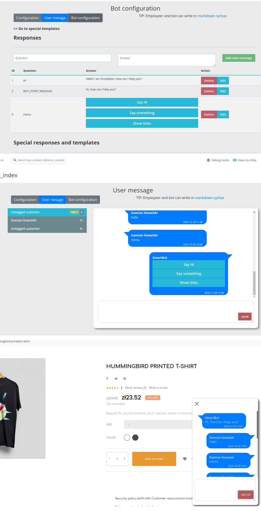

# Messager - Chat

Simple chat between employeer and customer. After first enter to the web, customer unlogged will receives token which makes unique talk.

You can change owner who will be recipiant, chat use ajax and is refreshing content on each 5s.

### Technology
* Vue CLI
* Bootstrap Vue
* Symfony

### Install
[install module - look here](https://github.com/damian-pm/prestashop_examples/tree/master/SimpleInstall.md)
