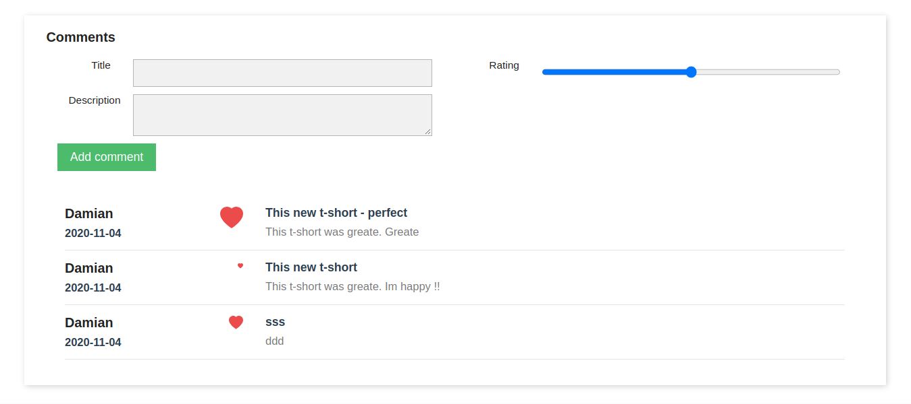

# Module Product Comments v.1.0.1

Module gave a opportunity to add comment for a product. All works under realtime action (ajax).

For developers: It shows how to connect front api, symfony (form, repository) and frontend framework.

#### Usage:
* Vue 2
* Symfony

### Install
[install module - look here](https://github.com/damian-pm/prestashop_examples/tree/master/SimpleInstall.md)

### Access
After install module ds_comment you have to hook this new module.

Got to `Admin Panel` > `Design` > `Position` > `Transplant a module`.

Choose there:
* Module: **Ds Product Comment**
* Transplant to: **displayFooterProduct**

.. and save

After that just view any product, under description should appear module.
