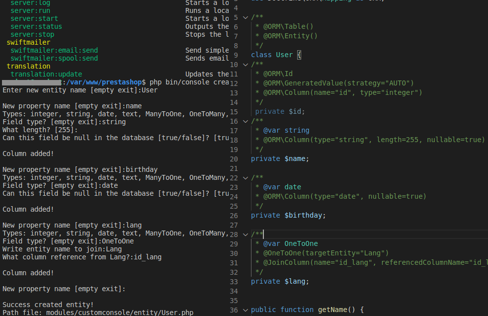

# Module Custom Console
You can see here how works console command and how simple add new entity with get/set methods. Command only generate file php.




### Install
[install module - look here](https://github.com/damian-pm/prestashop_examples/tree/master/SimpleInstall.md)

### Configuration
Configuration can be found in `Admin Panel`, `Module manager` and search `customconsole`.\

``Default entity path: src/PrestaShopBundle/Entity``

``Default entity namespace :PrestaShopBundle\Entity ``

### Access
```bash
  #show list command
  php bin/console
  # start generating entity
  php bin/console create:entity
```
