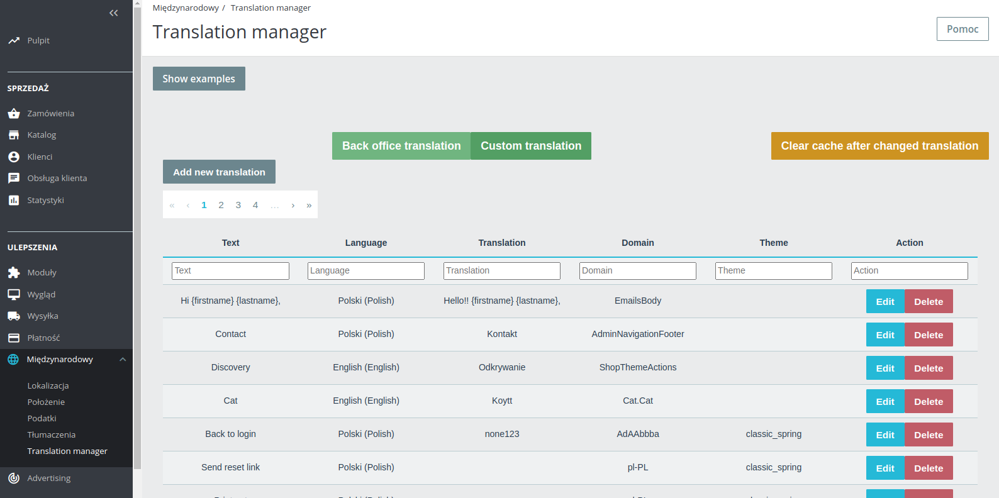

# Module - Translation manager ver 1.1.0
Very simple manager, you can sort them by text or by language. On the 'Custom translate' you can override existing translations.
After added one, you can use them by passing in template.

Module shows how to combine **Vue CLI and Symfony in PrestaShop module**.

### Required
* Bootstrap 4
* JQuery-ui




Watch out for naming domain. ShopThemeActions work only in themes/
### Usage
#### Smarty:
```smarty
# EmailsBody
{l s='Contact' d='Admin.Navigation.Footer'}
{l s='Hi {firstname} {lastname},' sprintf=['{firstname}' => 'Jan', '{lastname}' => 'Kowalski'] d='Emails.Body'}
# output:
Hello!! Jan Kowalski,
```
#### Twig:
```twig
# AdminNavigationFooter
{{'Hi {firstname} {lastname},'|trans({}, 'Emails.Body')}}
```

**Remember to clear cache! Sometimes PS not catching changes.**

### Install
[install module - look here](https://github.com/damian-pm/prestashop_examples/tree/master/SimpleInstall.md)


